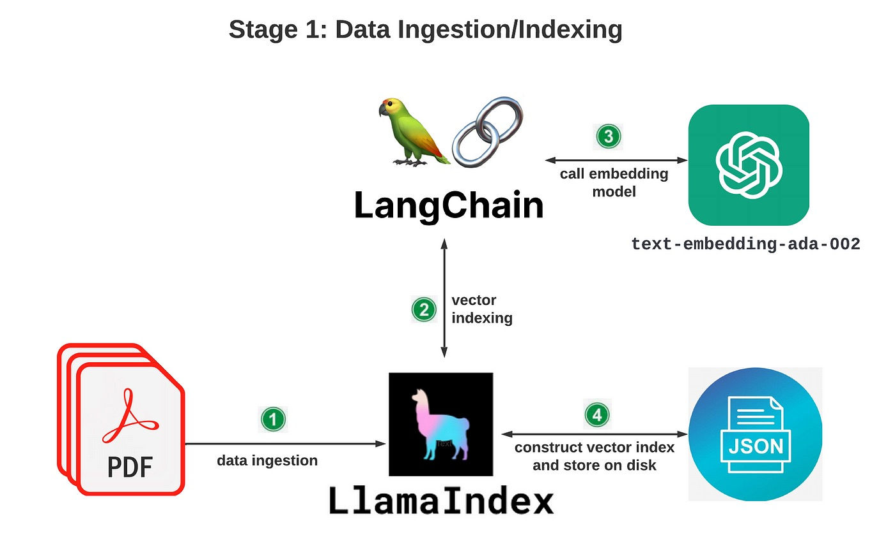
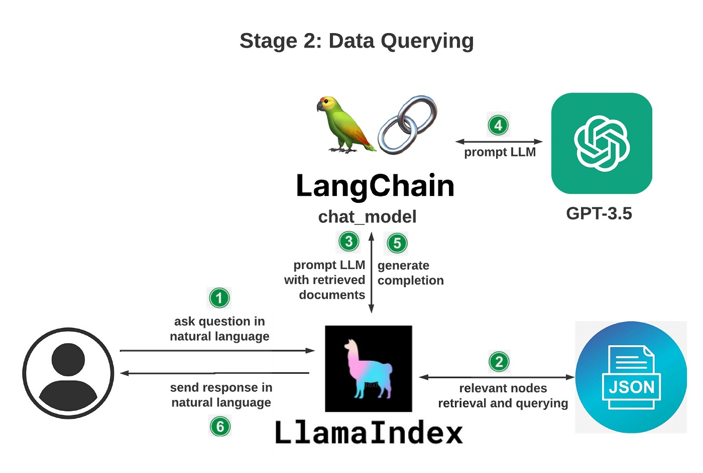

# AI-DevSecOps

探索使用 OpenAI、LangChain 和 LlamaIndex（GPT 索引）构建自定义 DevSecOps 知识库

## 架构

整理架构分为两个阶段：

### 数据摄取/索引



### 数据查询



## <a id="quick-start" href="#quick-start">🚀 Quick Start</a>

Create a virtual environment to run in.

```
python3 -m venv venv
source venv/bin/activate # ubuntu/Mac
venv\Scripts\activate # windows
pip3 install --upgrade pip
pip install -r requirements.txt
python3 bot.py
```

## You will see a result like this


