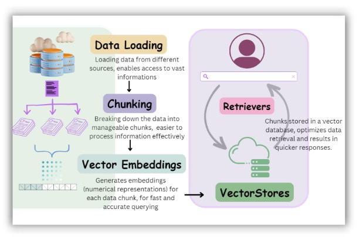
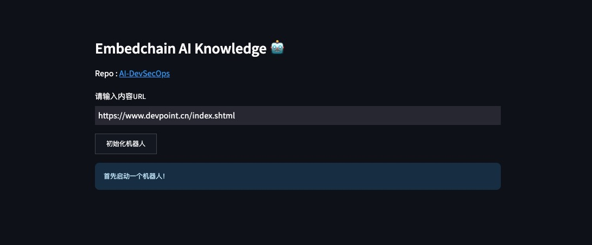

# AI-DevSecOps

[Embedchain](https://embedchain.ai/) 是一个多功能框架，可以轻松地在任何数据集上创建强大的 LLM 支持的聊天机器人。框架负责处理复杂的任务，例如从网页、PDF 和博客文章等各种来源加载数据。然后将数据分成有意义的块，生成嵌入 embeddings 以进行高效查询，并将这些块存储在矢量数据库中以便快速检索。

## 架构



## <a id="quick-start" href="#quick-start">🚀 Quick Start</a>

Create a virtual environment to run in.

```
python3 -m venv venv
source venv/bin/activate # ubuntu/Mac
venv\Scripts\activate # windows
pip install --upgrade pip
pip install databutton streamlit embedchain
streamlit run main.py
```

## You will see a result like this


